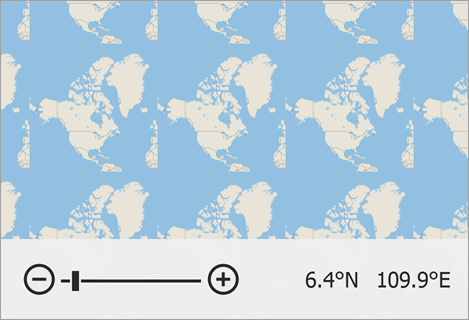

<!-- default badges list -->

<!-- default badges end -->
# Map for WinForms - Create a Custom Provider of Vector Tiles

This example shows how to create a custom provider that supplies the map with vector tiles.

To do this, create a class derived from the [VectorTileDataProviderBase](https://docs.devexpress.com/WindowsForms/DevExpress.XtraMap.VectorTileDataProviderBase) class. 

Override the provider's [`GetStream`](https://docs.devexpress.com/WindowsForms/DevExpress.XtraMap.VectorTileDataProviderBase.GetStream(System.Int64-System.Int64-System.Int64)?p=netframework) method so that it returns a tile as a sequence of bytes for specific coordinates in the [tile grid](https://en.wikipedia.org/wiki/Tiled_web_map) at the specified zoom level. In this example, the `GetStream` method loads binary data in the PBF format from the *Data/test.data* file.

Assign the provider to the [`ImageLayer.DataProvider`](https://docs.devexpress.com/WindowsForms/DevExpress.XtraMap.ImageLayer.DataProvider?p=netframework) property.

## Files to Look At

* [Form1.cs](./CS/Form1.cs) (VB: [Form1.vb](./VB/Form1.vb))

## Documentation

* [Vector Tile Providers](https://docs.devexpress.com/WindowsForms/401639/controls-and-libraries/map-control/vector-data/providing-data/vector-tile-providers?p=netframework)

## More Examples

* [How to Create a Data Provider to Load Image Tiles from a Custom Source](https://github.com/DevExpress-Examples/winforms-map-load-image-tiles-from-custom-source)
* [How to implement an in-memory image tile provider in the Map Control](https://github.com/DevExpress-Examples/how-to-use-in-memory-image-tile-provider)
